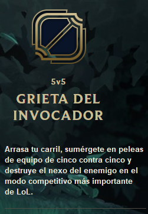
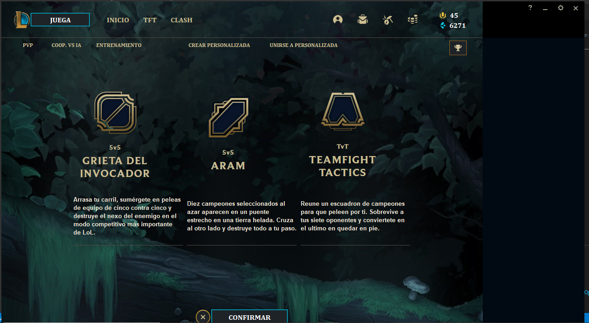
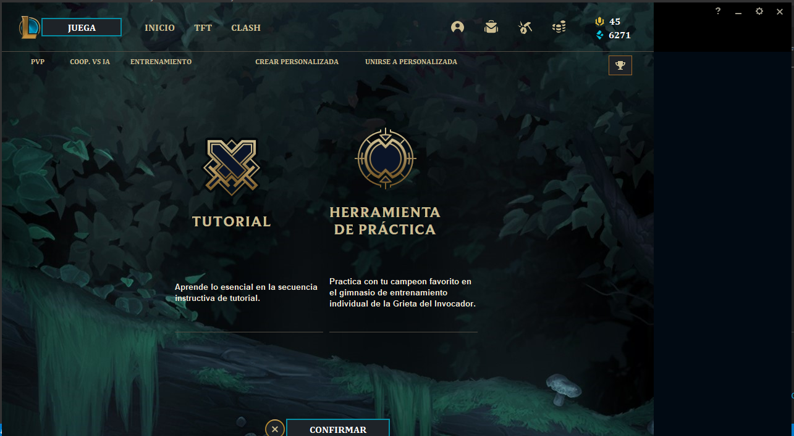
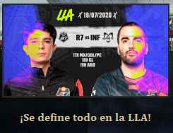
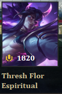
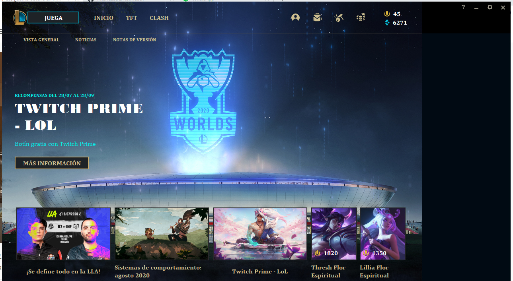

# Actividad # 7 - Reutilizacion de componentes
## Josue Nuñez Prada
Se realiza la reutilizacion de componentes gráficos por en diferentes vistas.

Este componente de la vista principal tiene: una imagen, un titulo y una descripcion

Esta es la vista del modo de juego en donde se reutiliza el componente hasta 3 veces

Esta es la vista del modo de juego de entrenamiento en donde se reutiliza el componente 2 veces

Este componente de la vista general tiene: una imagen y un titulo

Este componente de skin de la vista general tiene: una imagen y un precio y un nombre

Esta es la vista de la vista general en donde se reutiliza el componente noticia 3 veces, y 2 veces el componente skin

Este repositorio contiene el codigo de la septima actividad, correspondiente a la reutilizacion de componentes graficos

